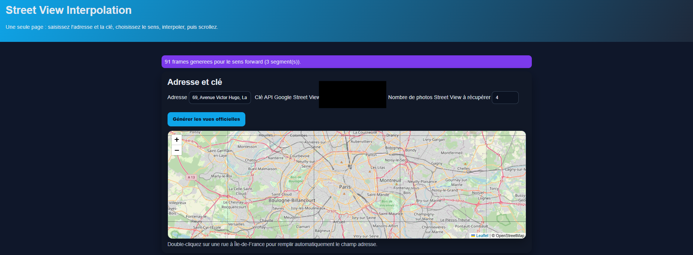
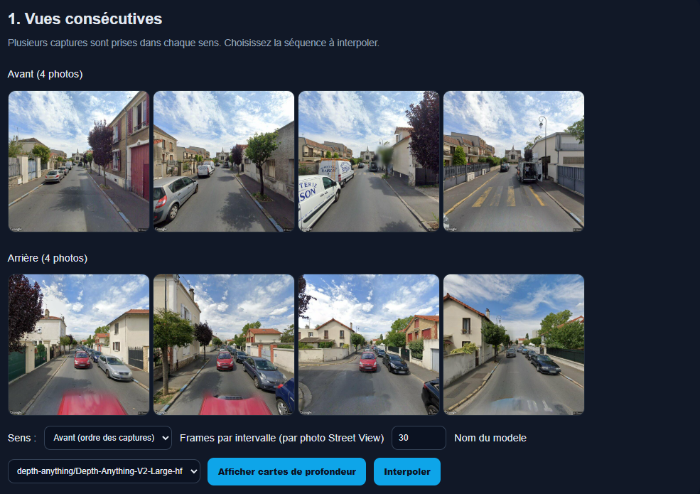
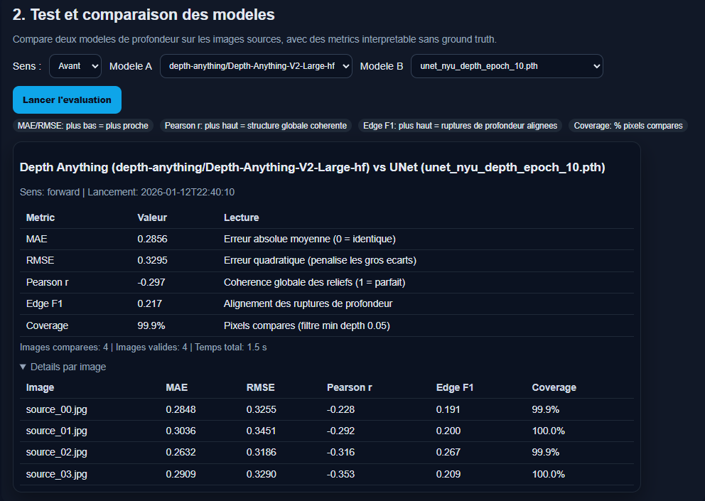
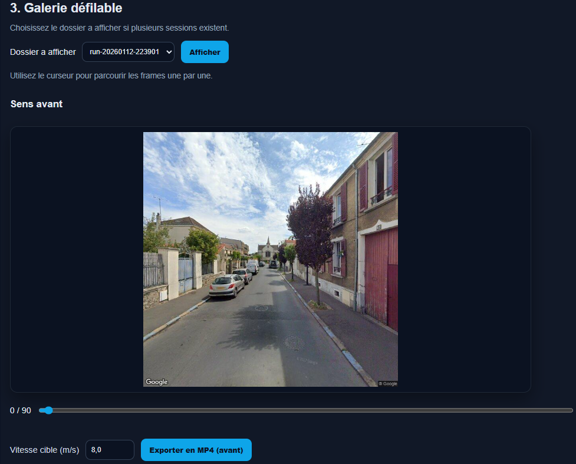
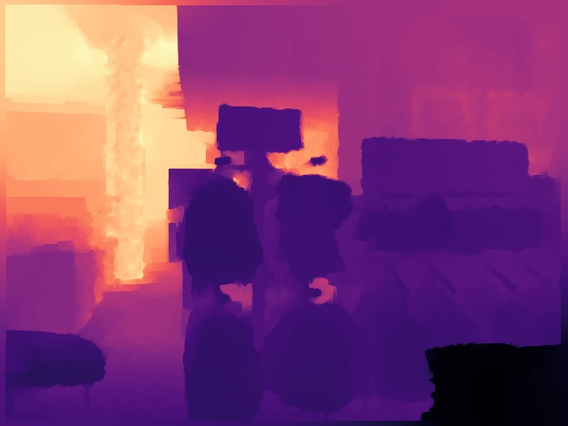
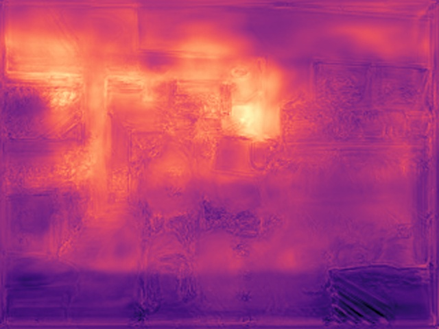
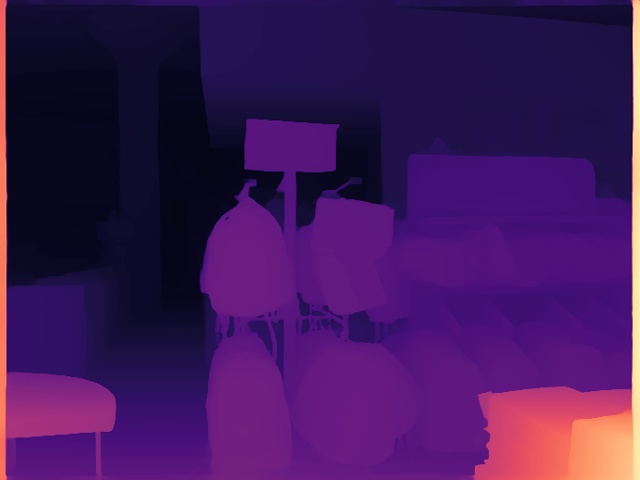

# Intermediate View Synthesis for Urban Navigation
## Research Report Based on the Street View Prototype

**Authors:** Maxim Qu\'enel, Pierre Louis Brun, Mame Al\`e Seye, Denis Bereziuc  
**Date:** January 2026

**Links**
- [GitHub](https://github.com/Maxim-Quenel/Intermediate-View-Synthesis-for-Urban-Navigation)
- [YouTube final result and comparison with Street View](https://youtu.be/juUFj2ofpQY)
- [YouTube usage demo](https://youtu.be/8IzJGnT3ex0)

## Abstract
Immersive Street View navigation still relies mostly on transitions between discrete panoramas, which produces a "tunnel effect" and parallax distortions. This report presents a complete intermediate-view synthesis system built around monocular depth estimation, differentiable 3D warping (softmax splatting), bidirectional fusion, and inpainting for disocclusions. We analyze the project in depth, detailing Street View data acquisition, preprocessing, model architectures (Depth Anything V2 and a UNet trained on Cityscapes Depth and Segmentation, outdoor scenes), generation parameters, and the metrics used. Results include quantitative analyses (files `metrics_forward.json` and `metrics_ground_truth.json`) and qualitative outputs (screenshots, depth maps, animation gallery). The report discusses limitations, lessons learned, and extensions toward models that are more robust to large baselines.

## Introduction
Urban visual navigation has progressed significantly in recent years, but consumer systems still follow a paradigm of navigation by "jumps" between panoramas. This discontinuity produces perceptual artifacts (distortions, deformation of nearby objects, lack of parallax) that limit the feeling of real motion. The goal of this project is to propose intermediate view synthesis that enables continuous forward motion between two geographic points, while keeping computational complexity compatible with interactive execution.

The prototype is built as a Flask application capable of: (i) collecting Street View images aligned with the road axis via the Google API, (ii) estimating depth with monocular models, (iii) reprojecting the scene into a new camera space, (iv) fusing forward/backward warps, (v) filling holes by inpainting, and (vi) exporting a video sequence. This report details the entire pipeline, along with its performance and limitations.

## Problem and Formulation
Let two source images $I_A$ and $I_B$ be associated with two camera positions along a road, separated by a distance $d$ estimated from GPS metadata. The goal is to generate a sequence of intermediate images $I_t$ for $t \in [0,1]$ that simulate continuous forward camera motion. Unlike classic 2D interpolation, the synthesis must respect 3D parallax: nearby objects should move faster than the background.

The problem can be formulated as a reprojection: estimate depth $D_A$ and $D_B$, convert pixels into 3D points, apply a virtual camera translation, then reproject onto the image plane. The main challenge comes from depth quality (often relative) and disoccluded regions, which are not visible in any source image.

## Related Work
The project sits in a dense research ecosystem mixing depth estimation, feature matching, and novel view synthesis.

### Depth Estimation and Geometry
Monocular depth estimation has evolved from classic CNN architectures to robust foundation models. While supervised approaches remain relevant for specific domains, recent models such as Depth Anything V2 [yang2024depth] offer impressive zero-shot generalization.  
In parallel, recovering 3D geometry traditionally relies on sparse descriptors (SIFT [sift]) or learned ones (SuperPoint [superpointrepo], XFeat [xfeatrepo]), filtered by RANSAC [ransac] or modern matchers like LightGlue [lightgluerepo].  
More recently, dense methods such as LoFTR [sun2021loftr], RoMa [edstedt2024roma], or the explicit 3D approach MASt3R [vincent2024mast3r] enable more coherent reconstruction, even in the presence of significant viewpoint changes.

### Optical Flow and Video Frame Interpolation (VFI)
Intermediate view synthesis can be approached as a video frame interpolation (VFI) problem. Models such as RIFE [riferepo], IFRNet [ifrnetrepo], or FILM [filmrepo] excel at smoothing videos with small motion. Likewise, dense optical flow estimation via RAFT [raftrepo] or SEA-RAFT [searaftrepo] models 2D motion.  
However, these purely 2D methods often struggle to maintain structural coherence on the large baselines typical of Street View (jumps of several meters), motivating explicit depth-guided warping.

### View Synthesis and Inpainting
For reprojection, softmax splatting [niklaus2020softmax] has become an effective method for handling depth conflicts in a differentiable way, outperforming rigid z-buffers.  
While volumetric approaches like NeRF (Zip-NeRF [barron2023zipnerf], S-NeRF [snerfrepo]) or 3D Gaussian Splatting [kerbl2023gaussian] offer higher photometric realism, they often require expensive per-scene training. Specific works such as *Infinite Nature* [infinitenature] or the *Cross Attention Renderer* [crossattentionrenderer] propose hybrid alternatives for generating long trajectories.  
Finally, handling disoccluded regions (the "holes" created by motion) is critical. Modern large-mask inpainting, illustrated by LaMa [suvorov2022lama] or MAT [li2022mat], is essential to hallucinate plausible textures in those regions that are invisible in the source images.

The project deliberately chooses a lightweight geometric approach, combining monocular depth and splatting, rather than heavy volumetric rendering. This decision is consistent with the "Street View" constraint where only a few images per segment are available (large baselines, displacements of about 10 m).

## Methodology
### Street View Acquisition
The collection of images is performed with the Google Street View API. The function `fetch_source_images` computes the main road orientation, queries metadata to obtain the nearest panorama ID, then advances meter by meter in the direction of travel until a new panorama is detected. The images are downloaded at size 640 px x 640 px, with a 90 deg field of view, zero pitch, and a heading aligned with the road. The recorded metadata include latitude, longitude, panorama ID, and the actual distance between successive panoramas (Haversine formula).

This acquisition guarantees a one-way stream, similar to a front-facing camera, in order to reduce the geometric complexity of spherical panoramas. The interface screenshots (Figure 1 and Figure 2) illustrate address selection and the presentation of source images.





### Depth Estimation
Two models are used:
- **Depth Anything V2** (pre-trained model): it generates relative depth in zero-shot. The map is normalized by min/max and a sky threshold is applied (values < 0.03 set to 0) to avoid distant noise.
- **Custom UNet** (trained on Cityscapes Depth and Segmentation, outdoor urban scenes): a 2D U-Net with `Conv+BN+ReLU` blocks, RGB input, depth output. The notebook `train_unet.ipynb` details the download via KaggleHub, the `CityscapesKaggleDataset` class (support `.npy`/`.png`) and training (batch size 8, learning rate $10^{-4}$, 5 epochs, MSE loss, resize 128 px x 256 px). This choice aligns training with outdoor scenes close to Street View.

### 3D Reprojection and Softmax Splatting
Each RGB image and its associated depth are converted into a 3D point cloud by back-projection, with a pinhole camera (FOV 90 deg, $f_x=f_y=(w/2)/\tan(\mathrm{FOV}/2)$). The normalized depth is transformed into a pseudo-metric depth by inversion ($z=1/(d+\epsilon)$), with a "sky" anchor fixed at a large distance (10000 m). A shift $\Delta z$ simulates the camera motion. Warping is performed by a differentiable softmax splatting:

$$
\hat{I}(p) = \frac{\sum_{q} I(q) \exp(m(q)) \mathbb{1}[q\to p]}{\sum_{q} \exp(m(q)) \mathbb{1}[q\to p] + \epsilon}
$$

with a metric $m$ based on depth (occlusions handled by weighting).

The projection uses the classic formulas: for a pixel $(u,v)$ with depth $z$,

$$
 x = (u-c_x)\,z/f_x, \quad y = (v-c_y)\,z/f_y,
$$

and after translation $z' = z - \Delta z$,

$$
 u' = x\,f_x/z' + c_x, \quad v' = y\,f_y/z' + c_y.
$$

Pixels with $z' \le 0.1$ are invalidated to avoid unstable divisions, then interpolated via splatting.

### Bidirectional Fusion and Inpainting
The system generates a *forward* warp (A->B) and a *backward* warp (B->A). An adaptive fusion combines both according to: (i) a linear temporal blend $t$; (ii) depth-based occlusion logic; (iii) change detection (RGB difference > 30) to speed up the transition on dynamic objects. Remaining holes are filled by LaMa if available, otherwise by OpenCV inpainting (Navier-Stokes).

### Motion Planning
The displacement is guided by a *distance hint* derived from GPS metadata. The real distance $d$ is converted into a virtual distance $s = 0.50 x d$ (fallback $s=0.35$). Dynamic braking applies a factor

$$
 t_{geo} = t \, (1 - \alpha t), \quad \alpha=0.36,
$$

allowing a gradual slowdown at the end of the segment. The code also forces insertion of the official images at segment boundaries to limit cumulative drift.

### Interface and Video Export
The Flask application exposes: (i) source generation, (ii) depth preview, (iii) model evaluation, (iv) animation gallery. The video frame rate is computed as:

$$
\mathrm{fps} = \mathrm{clamp}\left(\frac{v}{d_{frame}}, 8, 60\right)
$$

with $d_{frame}$ the real distance per frame and $v$ a target speed (8 m/s by default).

### Pipeline Summary
The full pipeline can be summarized by the following steps:
1. Acquisition of $N$ successive Street View images and GPS distances.
2. Estimation of depths $D_A, D_B$ (Depth Anything or UNet).
3. 3D warping of $I_A$ and $I_B$ toward an intermediate view via softmax splatting.
4. Bidirectional fusion with occlusion and change-state heuristics.
5. Inpainting of disocclusions (LaMa or OpenCV).
6. Insertion of official images at segment boundaries, export to frames then video.

## Implementation Details
The code is organized into clear modules: `generate_frames.py` for Street View acquisition, `depth_models.py` for depth inference, `interpolate.py` for warping and inpainting, `depth_metrics.py` for evaluation, and `app.py` for the Flask interface. The models are loaded with an LRU cache in order to limit inference overhead during preview and evaluation.

Outputs are organized in `street_view_project_output/run-YYYYMMDD-HHMMSS`, with subfolders for sources, frames, videos, and metrics. Each model comparison is stored in a `model_metrics/forward` or `model_metrics/ground_truth` directory with a `metrics.json` and a summary `metrics.txt`.

### Depth Handling
The model choice (UNet or Depth Anything) is resolved dynamically based on available files. For UNet, the code supports checkpoints prepared with or without BatchNorm, and automatically adapts the architecture based on the `state_dict`. For Depth Anything, inputs are processed via `AutoImageProcessor` and the result is interpolated to the original resolution.

### Complexity and Performance
Street View evaluation (4 images) is executed in 1.49 s on the current machine (see `duration_s` in `metrics_forward.json`), which gives an order of magnitude for multi-image inference. The pipeline uses CUDA if available, but provides a CPU fallback. Video export uses OpenCV and an adaptive FPS to keep a stable travel speed regardless of the distance between panoramas.

## Experiments and Protocol
### Datasets
**Street View.** The main experiments use sequences of 4 panoramas (`source_00` to `source_03`), automatically retrieved by the API. The images are rectilinear, aligned with the road, and of size 640 px x 640 px.

**Cityscapes Depth and Segmentation.** The UNet model is trained on this outdoor urban dataset (Kaggle) to better match Street View scenes. RGB images and depths are resized for fast training and loaded via `CityscapesKaggleDataset`.

**Batch ground truth (Cityscapes).** A batch of 100 pairs is used for evaluation (`data_train_test/photos` and `data_train_test/depth`). The reported metrics are averages over the batch, and the visuals show a representative sample.

### Preprocessing
Depth maps are normalized by min/max. The Depth Anything version applies a sky threshold $d < 0.03$. UNet outputs are resized to the original resolution and normalized to $[0,1]$. These choices favor warping stability but limit absolute metric interpretation.

### Model Parameters
**UNet:** 4-level U-Net (64-128-256-512), BN, MSE loss, Adam ($10^{-4}$), batch size 8, 5 epochs, images 128 px x 256 px (Cityscapes).  
**Depth Anything V2:** pre-trained model `depth-anything/Depth-Anything-V2-Large-hf`.

### Training Curve
Figure: Evolution of mean MSE loss per epoch during UNet training (Cityscapes Depth and Segmentation).

```tex
\begin{tikzpicture}
\begin{axis}[
  width=\linewidth,
  height=4.2cm,
  xlabel={Epoch},
  ylabel={MSE loss},
  xmin=1, xmax=5,
  ymin=0.0, ymax=0.006,
  ymajorgrids=true,
  xmajorgrids=true,
  grid style={dashed, gray!30},
  mark size=2.2pt,
]
\addplot[color=blue, mark=*] coordinates {(1,0.00529) (2,0.00289) (3,0.00258) (4,0.00239) (5,0.00230)};
\end{axis}
\end{tikzpicture}
```

### Metrics
Evaluation uses the functions in `depth_metrics.py`:
- MAE: $\frac{1}{N}\sum |d_a - d_b|$
- RMSE: $\sqrt{\frac{1}{N}\sum (d_a-d_b)^2}$
- Pearson $r$: linear correlation of valid depths
- Edge F1: F1-score on edge maps obtained by Sobel (90th percentile)
- Valid ratio: proportion of pixels $d > 0.05$

### Parameter Sensitivity
Several parameters directly influence visual quality: the real/virtual distance ratio (fixed at 0.50), the braking strength (0.36), the sky threshold (0.03), the occlusion threshold (0.5), and the visual change threshold (30). A ratio that is too low freezes the scene, while a ratio that is too high creates tearing at the borders. Braking reduces artifacts at the end of the segment but can produce a perceptible non-linear motion if the sequence is short. Using LaMa provides better spatial continuity than OpenCV inpainting, at the cost of longer inference time.

## Results
### Comparison Without Ground Truth
The file `metrics_forward.json` compares UNet and Depth Anything on 4 source images (forward direction). Table 1 summarizes the results. The positive Pearson $r$ indicates moderate structural consistency, with an expected scale mismatch (normalized Cityscapes UNet vs relative Depth Anything depth).

Table 1: UNet vs Depth Anything comparison.

| Metric | MAE | RMSE | r | Edge F1 | Valid |
| --- | ---: | ---: | ---: | ---: | ---: |
| Value | 0.1560 | 0.2241 | 0.5583 | 0.2146 | 0.9995 |

### Comparison With Ground Truth (Cityscapes batch, 100 images)
The file `metrics_ground_truth.json` evaluates both models on a batch of 100 pairs (photos/depths). Depth Anything achieves lower MAE/RMSE, a higher Pearson $r$, and a higher Edge F1 (Table 2). The values are batch averages, and the visuals below illustrate a sample from the batch.

Table 2: Comparison with ground truth (Cityscapes batch, averages over 100 images).

| Model | MAE | RMSE | r | EdgeF1 | Valid |
| --- | ---: | ---: | ---: | ---: | ---: |
| UNet | 0.1493 | 0.1874 | 0.7419 | 0.1701 | 0.7950 |
| Depth Anything | 0.0669 | 0.0805 | 0.9784 | 0.2416 | 0.7917 |

### Quantitative Visualizations
Figure: Graphical comparison on GT (Cityscapes batch, lower is better for MAE/RMSE, higher for Edge F1).

```tex
\begin{tikzpicture}
\begin{axis}[
  ybar,
  bar width=9pt,
  width=\linewidth,
  height=4.2cm,
  symbolic x coords={MAE,RMSE,EdgeF1},
  xtick=data,
  ymin=0,
  legend style={font=\scriptsize, at={(0.5,1.02)}, anchor=south},
]
\addplot coordinates {(MAE,0.1493) (RMSE,0.1874) (EdgeF1,0.1701)};
\addplot coordinates {(MAE,0.0669) (RMSE,0.0805) (EdgeF1,0.2416)};
\legend{UNet,Depth Anything}
\end{axis}
\end{tikzpicture}
```

Figure: MAE per image (Street View forward, UNet vs Depth Anything).

```tex
\begin{tikzpicture}
\begin{axis}[
  width=\linewidth,
  height=4.2cm,
  xlabel={Source image},
  ylabel={MAE},
  xtick={0,1,2,3},
  xticklabels={00,01,02,03},
  ymin=0.13,
  ymax=0.18,
]
\addplot coordinates {(0,0.1686) (1,0.1631) (2,0.1421) (3,0.1501)};
\end{axis}
\end{tikzpicture}
```

### Qualitative Analyses
The following figures gather qualitative outputs and system screenshots.














Figure: Visual comparison example.

### Detailed Qualitative Analysis
The qualitative outputs highlight several recurring phenomena. First, sky regions are well stabilized thanks to the depth threshold that removes distant noise; this reduces visual oscillations but can flatten some structures (e.g., very distant roofs). Next, thin objects (poles, signs) are sensitive to depth edge quality: overly smoothed depth creates "ghosts" during blending, while noisy depth creates irregular holes.

Bidirectional fusion clearly improves disoccluded areas: an object that disappears in the forward warp is often visible in the backward warp. The occlusion threshold (0.5) and the transition acceleration for changing regions (RGB diff > 30) limit ghosting on dynamic objects (cars, pedestrians), but can introduce breaks if contrast is strong (e.g., shadow changes).

Finally, LaMa inpainting provides plausible textures for the sky and facades, but its temporal consistency remains imperfect.

## Discussion
The results on the ground truth batch (100 images) show a clear advantage for Depth Anything: lower MAE/RMSE, higher Pearson $r$, and higher Edge F1. This difference is consistent with better zero-shot generalization, while the Cityscapes UNet remains more sensitive to scale and min/max normalization.

On Street View, the comparison without GT indicates moderate structural consistency (positive Pearson $r$), indicating that both models capture comparable relief but with scale differences. Despite this, the bidirectional fusion approach and softmax splatting produce plausible transitions, with artifacts mostly localized on borders and dynamic objects. LaMa inpainting visually limits holes, but temporal consistency is not guaranteed.

An important point is the use of a "distance hint" derived from GPS metadata. When the distance is available, geometric alignment is more stable than with the purely heuristic fallback. This dependence on metadata nonetheless highlights a fragility: noisy GPS or poorly spaced panoramas can desynchronize the transition, which amplifies warping errors.

The pipeline also shows the classic tension between per-frame quality and temporal consistency. More detailed depth maps (Depth Anything) improve some structures but produce inconsistencies from frame to frame. Conversely, UNet maps are smoother and can be more stable, but lose fine edges. A hybrid strategy (depth fusion, temporal smoothing) could stabilize the render without losing detail.

## Limitations and Lessons Learned
- **Large baselines.** Geometric warping suffers when the displacement between panoramas is large. Depth errors are amplified and create irreversible distortions.
- **Relative depth.** Min/max normalization and the sky threshold make inter-model comparison and absolute metric estimation difficult.
- **Limited data.** The ground truth evaluation uses 100 pairs (photos/depths). This remains insufficient for a strong statistical conclusion.
- **Domain shift.** Even with outdoor scenes, a gap remains between Cityscapes and Street View (geometry, dynamics, textures).
- **NYU Depth V2 trial.** We tested NYU, but it could not work well outdoors, since the dataset does not contain outdoor photos.
- **Dynamic objects.** Change-state detection by RGB difference remains heuristic and can be fooled by lighting changes.
- **Reproducibility.** The Street View API depends on a key and external data (potentially unstable over time).

## Possible Extensions
- Use metric depth models (Metric3D, MASt3R) to obtain more reliable absolute scale.
- Exploit dense correspondences (RoMa, LoFTR) to refine fusion and detect occlusions.
- Introduce temporal models (VFI or conditional diffusion) to stabilize transitions.
- Test on more sequences and set up larger-scale quantitative validation.

## Conclusion
This project delivers a complete intermediate-view synthesis prototype for Street View, combining depth estimation, 3D reprojection, and inpainting. Qualitative analyses validate the feasibility of smooth motion, while quantitative metrics highlight the pipeline's sensitivity to depth quality. The next step is to strengthen geometric consistency at large baselines and extend statistical evaluation.

## Reproducibility (Summary)
- Configuration: provide the API key in `config.txt` or via `GOOGLE_API_KEY`.
- Dependencies: `requests`, `opencv-python`, `torch`, `transformers`, `simple-lama-inpainting`, etc. (see `requirements.txt`).
- Execution: run `app.py` then generate a session, preview depth, interpolate, and export.
- Evaluation: use the "Evaluate models" and "Ground truth" buttons to generate metrics files.

## Appendix
### Details of Per-Image Metrics
Table: Per-image metrics (Street View, forward).

| Image | MAE | RMSE | r | EdgeF1 | Valid |
| --- | ---: | ---: | ---: | ---: | ---: |
| source_00.jpg | 0.1686 | 0.2405 | 0.5039 | 0.1929 | 0.9994 |
| source_01.jpg | 0.1631 | 0.2444 | 0.5775 | 0.1853 | 0.9992 |
| source_02.jpg | 0.1421 | 0.2092 | 0.5949 | 0.2682 | 0.9997 |
| source_03.jpg | 0.1501 | 0.2023 | 0.5570 | 0.2119 | 0.9997 |

## References
### Papers with Code
- **yang2024depth** L. Yang et al., "Depth Anything V2: A more capable foundation model for monocular depth estimation," NeurIPS 2024. https://github.com/DepthAnything/Depth-Anything-V2
- **vincent2024mast3r** E. Vincent et al., "MASt3R: Grounding image matching in 3D," arXiv 2024. https://github.com/naver/mast3r
- **sun2021loftr** J. Sun et al., "LoFTR: Detector-free local feature matching with transformers," CVPR 2021. https://github.com/zju3dv/LoFTR
- **edstedt2024roma** J. Edstedt et al., "RoMa: Robust dense feature matching," CVPR 2024. https://github.com/Parskatt/RoMa

### Other Papers
- **niklaus2020softmax** S. Niklaus and F. Liu, "Softmax splatting for video frame interpolation," CVPR 2020. https://github.com/sniklaus/softmax-splatting
- **barron2023zipnerf** J. T. Barron et al., "Zip-NeRF: Anti-aliased grid-based neural radiance fields," ICCV 2023. https://github.com/google-research/multinerf
- **kerbl2023gaussian** B. Kerbl et al., "3D Gaussian Splatting for real-time radiance field rendering," SIGGRAPH 2023. https://github.com/graphdeco-inria/gaussian-splatting
- **suvorov2022lama** R. Suvorov et al., "Resolution-robust large mask inpainting with Fourier convolutions (LaMa)," WACV 2022. https://github.com/advimman/lama
- **li2022mat** W. Li et al., "MAT: Mask-Aware Transformer for large hole image inpainting," CVPR 2022. https://github.com/fenglinglwb/MAT

### General Concepts and Wikis
- **sift** SIFT (Scale-Invariant Feature Transform). https://en.wikipedia.org/wiki/Scale-invariant_feature_transform
- **ransac** RANSAC. https://en.wikipedia.org/wiki/Random_sample_consensus

### Code Repositories (Papers Not Listed Above)
- **superpointrepo** SuperPoint (code repository). https://github.com/magicleap/SuperPointPretrainedNetwork
- **lightgluerepo** LightGlue (code repository). https://github.com/cvg/LightGlue
- **xfeatrepo** XFeat (code repository). https://github.com/verlab/accelerated_features
- **raftrepo** RAFT (optical flow, code repository). https://github.com/princeton-vl/RAFT
- **searaftrepo** SEA-RAFT (code repository). https://github.com/princeton-vl/SEA-RAFT
- **crossattentionrenderer** Learning to Render Novel Views from Wide-Baseline Stereo Pairs (code repository). https://github.com/yilundu/cross_attention_renderer
- **snerfrepo** S-NeRF (code repository). https://github.com/fudan-zvg/S-NeRF
- **riferepo** RIFE (code repository). https://github.com/megvii-research/ECCV2022-RIFE
- **ifrnetrepo** IFRNet (code repository). https://github.com/ltkong218/IFRNet
- **filmrepo** FILM (code repository). https://github.com/google-research/frame-interpolation
- **infinitenature** Infinite Nature (Google Research). https://github.com/google-research/google-research/tree/master/infinite_nature

### Other Resources
- **disneyfitug** Frame Interpolation Transformer and Uncertainty Guidance. https://assets.studios.disneyresearch.com/app/uploads/2023/05/Frame-Interpolation-Transformer-and-Uncertainty-Guidance-1.pdf
- **immersiveview** Google Maps Immersive View. https://blog.google/intl/fr-fr/nouveautes-produits/explorez-obtenez-des-reponses/google-maps-immersive-view-itineraires-nouvelles-fonctionnalites-ia/
